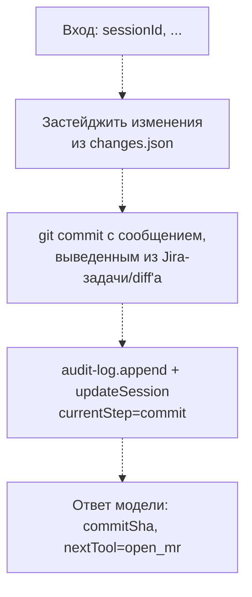

# commit

**Статус: заглушка, ещё не реализовано.**

Шаг пайплайна `commit`: коммитит застейдженные изменения в ветку, созданную на предыдущем шаге `create_branch`.

## Диаграмма (планируемый поток)

## Подробное описание

Пока не реализовано — файл содержит только комментарий-заглушку, инструмент не зарегистрирован в `server.ts`.

Ожидаемая роль в пайплайне (`StepName` в `state/session-store/types.ts`): следует за `create_branch`, предшествует `open_mr`. Должен опираться на `changes.json`, записанный шагом `read_changes` (список затронутых файлов), и на сессию, созданную `start_session`, следуя тому же fail-closed паттерну, что и уже реализованные шаги (`read_changes`, `ship_report`): побочные эффекты (audit-событие, `updateSession`) фиксируются только после того, как коммит реально создан.
