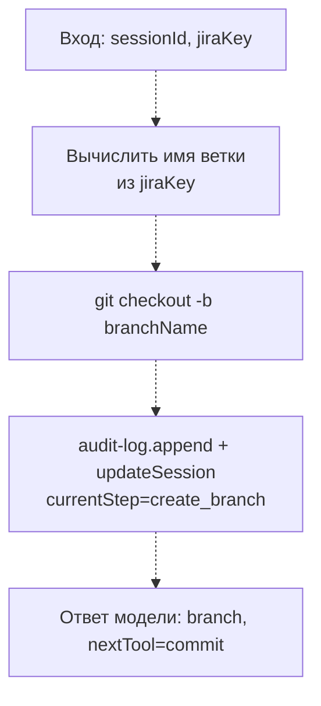

# create_branch

**Статус: заглушка, ещё не реализовано.**

Шаг пайплайна `create_branch`: создаёт git-ветку под изменение, обычно с именем, производным от ключа Jira-задачи, созданной на шаге `create_jira_task`.

## Диаграмма (планируемый поток)

## Подробное описание

Пока не реализовано — файл содержит только комментарий-заглушку, инструмент не зарегистрирован в `server.ts`.

Ожидаемая роль в пайплайне (`StepName` в `state/session-store/types.ts`): следует за `create_jira_task`, предшествует `commit`. Принимает ключ Jira-задачи (результат `create_jira_task`) и строит из него имя ветки по соглашению проекта, затем создаёт ветку в целевом репозитории.
