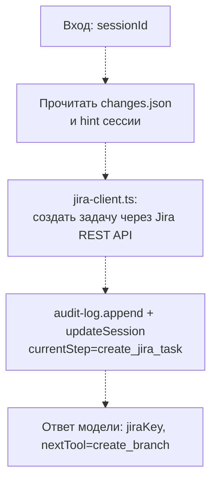

# create_jira_task

**Статус: заглушка, ещё не реализовано.**

Шаг пайплайна `create_jira_task`: создаёт Jira-задачу под изменение, на основе разобранного диффа (`changes.json`, результат `read_changes`) и `hint`, сохранённого на сессии шагом `start_session`.

## Диаграмма (планируемый поток)

## Подробное описание

Пока не реализовано — файл содержит только комментарий-заглушку, инструмент не зарегистрирован в `server.ts`. Сейчас `quality_precheck` (см. `../quality-precheck/README.md`) возвращает `nextTool: "create_jira_task"` с пометкой, что этот инструмент ещё не существует.

Ожидаемая роль в пайплайне (`StepName` в `state/session-store/types.ts`): следует за `quality_precheck`, предшествует `create_branch`. Будет опираться на ещё не реализованный `src/clients/jira-client.ts` для вызова Jira REST API и на содержимое `changes.json` (структурированный diff) для формирования описания задачи.
