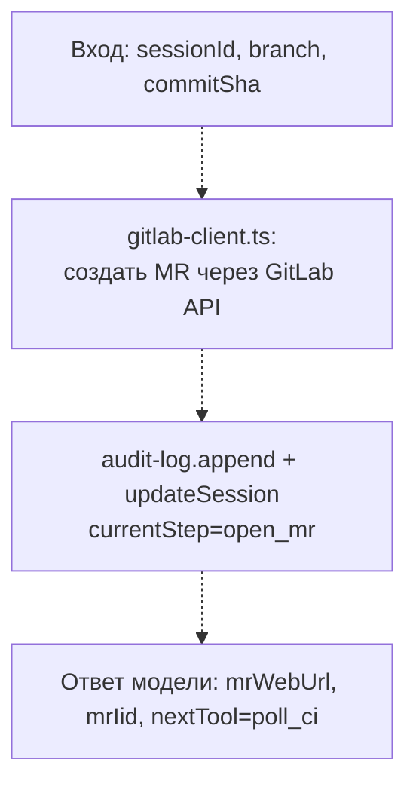

# open_mr

**Статус: заглушка, ещё не реализовано.**

Шаг пайплайна `open_mr`: открывает merge/pull request для ветки, закоммиченной на шаге `commit`.

## Диаграмма (планируемый поток)

## Подробное описание

Пока не реализовано — файл содержит только комментарий-заглушку, инструмент не зарегистрирован в `server.ts`.

Ожидаемая роль в пайплайне (`StepName` в `state/session-store/types.ts`): следует за `commit`, предшествует `poll_ci`. Будет опираться на ещё не реализованный `src/clients/gitlab-client.ts` для вызова GitLab API и создания merge request из закоммиченной ветки. Результат (`mrWebUrl`, `mrIid`) — те же поля, что позже требует вход `ship_report` (см. `../report/README.md`).
