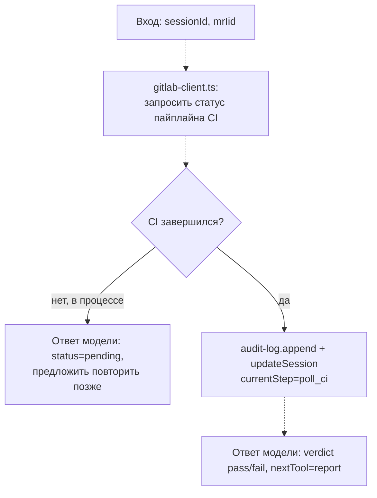

# poll_ci

**Статус: заглушка, ещё не реализовано.**

Шаг пайплайна `poll_ci`: опрашивает статус CI для merge request, открытого на шаге `open_mr`.

## Диаграмма (планируемый поток)

## Подробное описание

Пока не реализовано — файл содержит только комментарий-заглушку, инструмент не зарегистрирован в `server.ts`.

Ожидаемая роль в пайплайне (`StepName` в `state/session-store/types.ts`): следует за `open_mr`, предшествует `report` — последнему шагу. Будет опираться на ещё не реализованный `src/clients/gitlab-client.ts` для опроса статуса CI-пайплайна GitLab по `mrIid`, полученному от `open_mr`. Итоговый вердикт понадобится как поле `verdict` во входе `ship_report` (см. `../report/README.md`).
