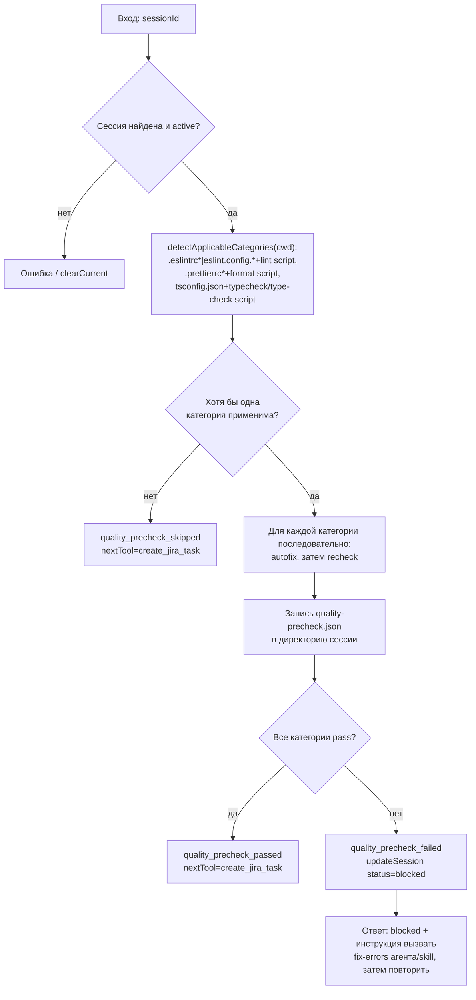

# quality_precheck

Узел 3 пайплайна ship-changes — механический pre-check качества написанного кода между `read_changes` и `create_jira_task`. Проверяет lint/prettier/typescript в целевом репозитории (`process.cwd()`), запускает автофикс каждого применимого инструмента, затем повторную проверку. Семантические проверки (смешение неродственных изменений, забытая логика) вне области ответственности этого узла.

## Диаграмма

## Подробное описание

**Вход** (`input-schema.ts`): только `sessionId`. Узел ничего не спрашивает у модели/пользователя — все решения принимаются исключительно по состоянию целевого репозитория.

**Обнаружение применимых категорий** (`detect-tooling.ts`): ровно три категории, каждая требует ОБА условия одновременно —

- `lint`: файл `.eslintrc*` или `eslint.config.*` в корне целевого репозитория И script `lint` в его `package.json`;
- `prettier`: файл `.prettierrc*` И script `format`;
- `typescript`: файл `tsconfig.json` И script `typecheck` или `type-check`.

Никакие другие источники (CLAUDE.md-конвенции, skills, содержимое конфигов) не рассматриваются. Отсутствующий/битый `package.json` — категория просто не применима, не ошибка. Если не применима ни одна категория — узел полностью пропускается: `quality_precheck_skipped`, без блокировки и без предупреждения, пайплайн продолжается дальше.

**Запуск категорий** (`run-category.ts`): для каждой обнаруженной категории бинарник резолвится напрямую — `<targetRepoDir>/node_modules/.bin/<eslint|prettier|tsc>`, при отсутствии — `npx --no-install <tool>` (без сети и интерактивных промптов). Тело package.json-script игнорируется — его существование использовалось только как сигнал обнаружения, а не как способ запуска, поскольку это ненадёжно предсказало бы точные флаги автофикса.

- **lint**: автофикс `eslint . --fix --format json`, затем recheck `eslint . --format json`; `fail`, если `errorCount + warningCount > 0` (warnings тоже блокируют).
- **prettier**: автофикс `prettier --write .`, затем recheck `prettier --check .`; `fail` при ненулевом exit code.
- **typescript**: автофикса нет; только `tsc -p tsconfig.json --noEmit`; `fail` при ненулевом exit code.

Ненулевой exit code инструмента — штатный сценарий (есть находки), а не сбой процесса: перехватывается и разбирается stdout/stderr пойманного исключения (см. прецедент в `read-changes/run-structure-script.ts`). Только `ENOENT` (бинарник не резолвился вовсе) даёт категории статус `error`, не обрушивая весь узел. Категории запускаются строго последовательно — снимки `git status --porcelain` до/после автофикса каждой категории (флаг `autofixed`) корректны только без параллелизма.

**Побочные эффекты** (только после реально выполненной проверки):

- Полный сырой вывод каждого инструмента (JSON от eslint, список файлов от prettier, диагностика tsc) пишется в `quality-precheck.json` внутри директории сессии — по аналогии с `changes.json` у `read_changes`.
- `audit-log.append("quality_precheck_skipped" | "quality_precheck_passed" | "quality_precheck_failed", { ... })` — с компактной сводкой по категориям (`category`, `status`, `autofixed`, `findingsCount`), без сырого вывода.
- `session-store.updateSession(sessionId, { currentStep: "quality_precheck", event, detail })`. При неуспехе (`quality_precheck_failed`) сессия дополнительно переводится в `status: "blocked"`.

**Возврат модели**:

- Пропуск: `{ status: "skipped", categoriesDetected: [], nextTool: "create_jira_task", note }`.
- Успех: `{ status: "completed", categoriesDetected, results: [{ category, status, autofixed, findingsCount?, message }], nextTool: "create_jira_task", note }` — сообщение по каждой категории отдельно (`lint: pass`, `prettier: pass (auto-fixed)`, `typescript: pass`), а не один общий булев статус.
- Неуспех: обычный текст `blocked: unresolved quality findings — ...`, с путём к `quality-precheck.json` и явной инструкцией вызвать проектного fix-errors агента/skill (это отдельный агент, живущий в проекте пользователя, а не часть этого MCP-сервера и не отдельный шаг `StepName`), затем вручную вернуть сессию в `active` (см. `session-store/README.md`, раздел «Ручное восстановление зависшей сессии») и вызвать `quality_precheck` повторно.

`nextTool` в успешном/пропущенном случае указывает на `create_jira_task`, который пока не реализован (см. его `README.md`) — это только подсказка модели о следующем шаге спецификации пайплайна, не гарантия, что инструмент уже вызываем.
