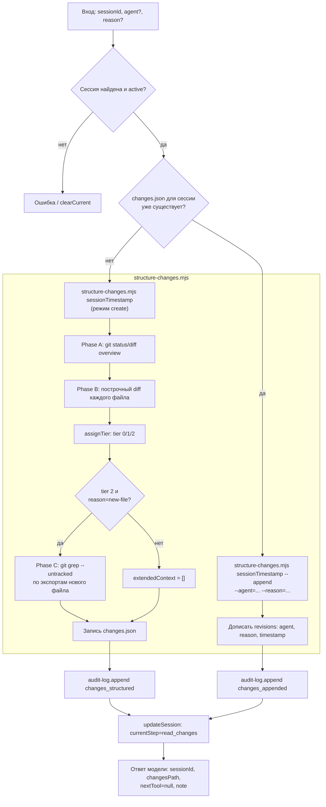

# read_changes

Первый шаг пайплайна ship-changes после `start_session`. Структурирует изменения рабочего дерева целевого репозитория в единый снимок `changes.json` и возвращает модели только минимальное подтверждение — без сырых диффов и без сводных цифр.

## Диаграмма

## Подробное описание

**Вход** (`input-schema.ts`):
- `sessionId` (обязателен) — UUID, возвращённый `start_session`.
- `agent`, `reason` (опциональны) — используются только при повторном вызове для той же сессии (см. ниже); на первом вызове игнорируются.

**Определение режима** (`run-structure-script.ts`): перед запуском скрипта проверяется, существует ли `changes.json` в директории сессии (`sessionDirFor(session)`). Если нет — запуск в режиме `create` (первый и единственный полный снимок `files[]` за сессию). Если да — запуск с `--append --agent=<agent> --reason=<reason>`, что позволяет другому агенту на более позднем шаге пайплайна повторно дёрнуть `read_changes` и получить запись в `revisions[]`, не перезаписывая исходный снимок.

**Скрипт-структуризатор** (`../../../scripts/structure-changes.mjs`, отдельный Node-скрипт без npm-зависимостей, вызываемый через `execFileSync`) реализует три фазы:
- **Phase A** — общая картина: `git status --porcelain=v2 --branch --untracked-files=all` + `git diff --numstat HEAD`.
- **Phase B** — построчное чтение diff'а КАЖДОГО файла без пропусков (fail-closed на неожиданный формат `git status`).
- **Phase C** — расширенный контекст только для файлов Tier 2 с причиной `new-file`: поиск точек регистрации нового файла в остальном репозитории через `git grep -n -F --untracked` по извлечённым идентификаторам (basename файла + топ-уровневые `export`), включая ещё не закоммиченные файлы-потребители.

Tier назначается по комбинации признаков (`assignTier`): denylist (Tier 0, контент не читается), новый/расширенный по пути/размеру файл (Tier 2, полный контекст + Phase C), иначе Tier 1 (только сам diff).

**Побочные эффекты** (только внутри `run-read-changes.ts`, после реально выполненной работы):
- `audit-log.append("changes_structured" | "changes_appended", { summary })`.
- `session-store.updateSession(sessionId, { currentStep: "read_changes", event: ... })` — переводит дисковую сессию, дописывает событие в `session.json`.
- Блокирующий случай (нет изменений в рабочем дереве) переводит сессию в статус `blocked` и возвращает `blocked: ...` вместо ошибки.

**Возврат модели** — только `{ sessionId, step, status, changesPath, nextTool, note }`. `nextTool` сейчас всегда `null` с поясняющим `note`, так как `create_jira_task` (следующий шаг по спецификации пайплайна) ещё не реализован. Полное содержимое (`files[]`, диффы, `extendedContext`) остаётся на диске в `changesPath` и читается адресно, только когда это реально понадобится следующему шагу.
