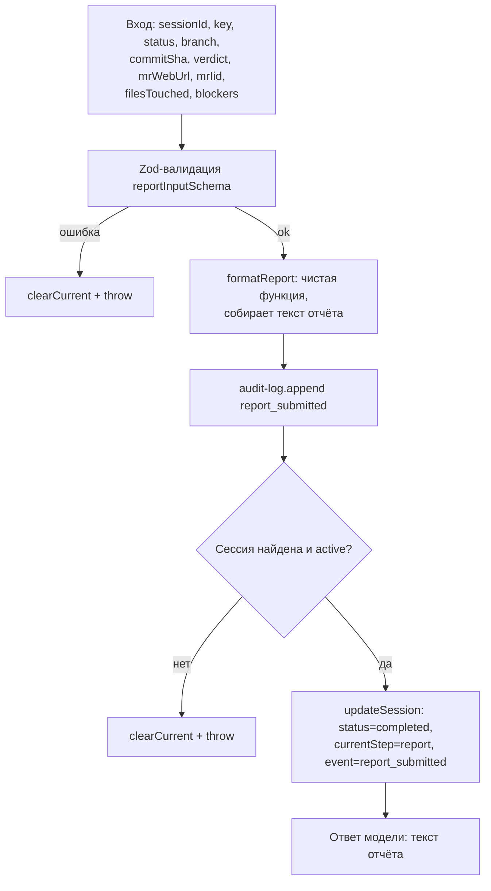

# ship_report

Финальный, обязательный шаг пайплайна ship-changes. Единственный способ получить текст итогового отчёта — модель не может написать его текст самостоятельно в обход этого инструмента (fail-closed паттерн: см. `CLAUDE.md` в корне пакета).

## Диаграмма

## Подробное описание

**Вход** (`input-schema.ts`, `reportInputShape`): `sessionId` (сессия, которую отчёт закрывает), `key` (ключ Jira-задачи), `status` (`Resolved` | `Awaiting Deployment`), `branch`, `commitSha`, `verdict` (`pass` | `changes_requested` — итог код-ревью MR), `mrWebUrl`, `mrIid`, `filesTouched` (список путей), `blockers` (список нерешённых блокеров, по умолчанию пустой).

**`formatReport`** (`format-report.ts`) — чистая функция без побочных эффектов, собирает человекочитаемый текст отчёта (статус задачи, ветка/коммит, вердикт ревью, ссылка на MR, список файлов, блокеры).

**`runReport`** (`run-report.ts`) — единственный код-путь, который:

1. Валидирует вход через `reportInputSchema.parse`.
2. Вызывает `formatReport` для получения текста.
3. Пишет audit-событие `report_submitted` (`audit-log.append`) — **после** того, как текст реально сформирован, а не до.
4. Проверяет, что сессия существует и активна, иначе бросает ошибку.
5. Переводит дисковую сессию в статус `completed` через `updateSession` (единый источник истины `session.json`).

Побочные эффекты (audit-событие, маркер завершения шага `report`, статус `completed` сессии) записываются только внутри этой функции, после реально выполненной работы — это и есть fail-closed гарантия: модель не может подделать факт отправки отчёта, не вызвав этот инструмент.

**Возврат модели** — только текст отчёта (`formatReport`), без дополнительной обёртки с метаданными.
