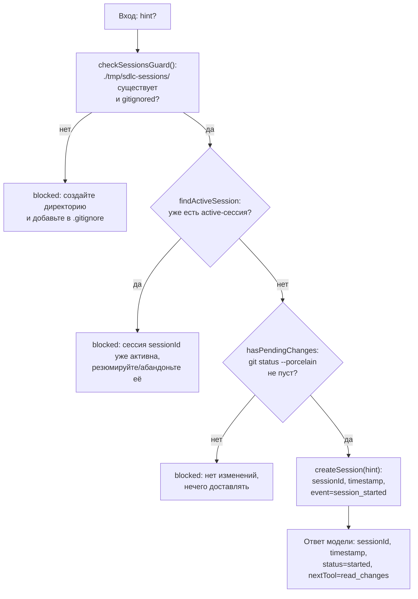

# start_session

Точка входа пайплайна ship-changes — должна вызываться первой. Создаёт файл сессии, на который обязаны ссылаться (через `sessionId`) все последующие вызовы инструментов пайплайна.

## Диаграмма

## Подробное описание

**Вход** (`input-schema.ts`): `hint` — опциональная свободная строка с описанием намерения изменения, сохраняется на сессии как есть, чтобы более поздние шаги пайплайна (например, создание Jira-задачи) могли её прочитать без повторной передачи.

**Три проверки строго в этом порядке** (`run-start-session.ts`), каждая — самостоятельная точка отказа с единообразным ответом `blocked: <причина>` (хелпер `blocked`):
1. `checkSessionsGuard()` (`session-store/guard.ts`) — `./tmp/sdlc-sessions/` должна существовать на диске и быть реально проигнорирована git'ом (проверяется через `git check-ignore`, а не построчным сравнением с `.gitignore`). Проверяется первой, до любого обращения к файловой системе сессий.
2. `findActiveSession()` (`session-store/session-repository.ts`) — детерминированно возвращает самую свежую по `timestamp` сессию со статусом `active`, если такая есть на диске. Если найдена — новую сессию начать нельзя, пока прежняя не резюмирована/не абандонена.
3. `hasPendingChanges()` (`has-pending-changes.ts`) — `git status --porcelain` в `process.cwd()` не должен быть пустым; иначе пайплайну нечего доставлять.

Только если все три проверки прошли успешно, вызывается `createSession(hint)` (`session-store/create-session.ts`), которая создаёт `sessionId`, `timestamp`, событие `session_started` и персистит новую сессию на диск (`session.json` + `log.md` в `./tmp/sdlc-sessions/sdlc-<timestamp>/`).

**Возврат модели** — `{ sessionId, timestamp, status: "started", nextTool: "read_changes" }`, инструктирующий модель вызвать `read_changes` следующим с этим `sessionId`.
