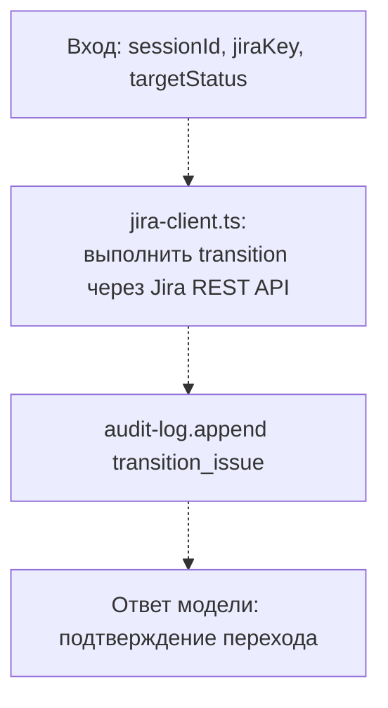

# transition_issue

**Статус: заглушка, ещё не реализовано.**

Инструмент `transition_issue`: переводит Jira-задачу по статусам workflow. В отличие от остальных инструментов пайплайна, **не входит** в линейную последовательность `StepName` (`state/session-store/types.ts`) — переходы статуса могут случаться в нескольких точках пайплайна (например, при блокировке, при начале ревью, при деплое), а не строго между двумя соседними шагами.

## Диаграмма (планируемый поток)

## Подробное описание

Пока не реализовано — файл содержит только комментарий-заглушку, инструмент не зарегистрирован в `server.ts`.

В отличие от `commit`/`create-branch`/`open-mr`/`poll-ci` (которые займут фиксированное место между двумя соседними шагами `StepName`), этот инструмент может вызываться из нескольких точек пайплайна — везде, где нужно перевести Jira-задачу в новый статус workflow (например, "In Review" при открытии MR, "Done" при успешном деплое). Будет опираться на ещё не реализованный `src/clients/jira-client.ts`.
